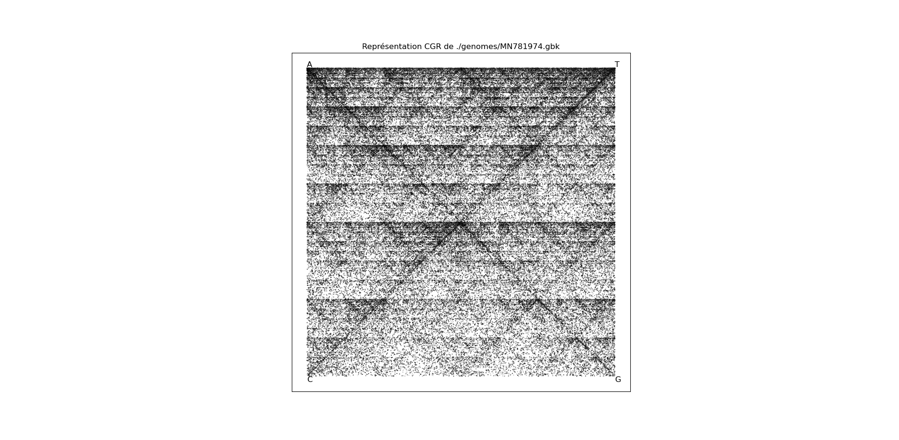
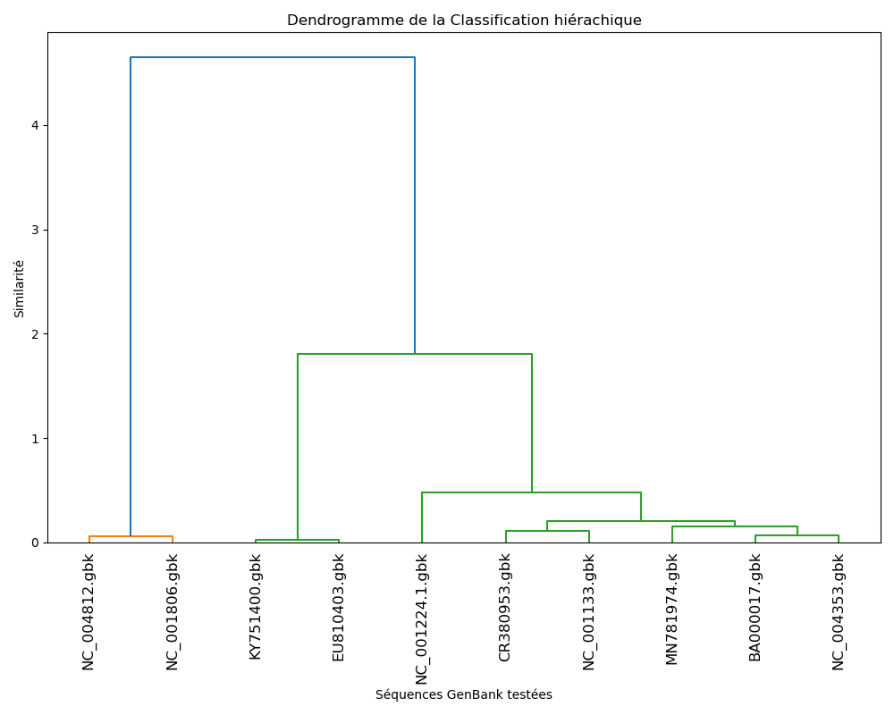

# Projet Chaos-Game

Dans ce projet, l'objectif est de générer des k-mers, des sous-séquences de longueur k extraites d'une séquence d'acides nucléiques, et d'appliquer la méthode du Chaos Game pour obtenir une représentation spécifique du génome, parfois appelée "signature génomique".

L'algorithme du Chaos Game convertit une séquence de nucléotides (ADN ou ARN) en une série de coordonnées dans un espace bidimensionnel puis associe chaque base à un déplacement spécifique dans cet espace. En suivant ces règles, chaque nucléotide génère un point dans l'espace, formant ainsi une trajectoire ou un motif visuel représentant la séquence de manière unique.

## Fonctionnalités
Ce projet contient trois programmes Python pour l'analyse et la représentation visuelle de séquences d'ADN en utilisant l'algorithme du Chaos Game et des techniques de clustering hiérarchique.

- [chaos_game.py](chaos_game.py) : Génère une représentation visuelle d'une séquence d'ADN.
- [genomic_sign.py](genomic_sign.py) : Génère une signature génomique spécifique de la séquenced'une séquence d'ADN.
- [clustering.py](clustering.py) : Effectue un clustering hiérarchique basé sur la signature génomique des séquences d'ADN d'un dossier.

### chaos_game.py

Ce programme prend en entrée un fichier GenBank contenant une séquence d'ADN et génère une représentation graphique de cette séquence en utilisant l'algorithme du Chaos Game.

- **Fonctionnalités :**
  - 1.`read_sequence_from_gbk`: Lecture du fichier GenBank et extraction de la séquence d'ADN.
  - 2.`generate_cgr_coordinates`: Génère les coordonnées pour chaque nucléotide dans l'espace du Chaos Game.
  - 3.`plot_cgr`: Représente graphiquement les coordonnées dans l'espace du Chaos Game.

### genomic_sign.py

Ce programme prend en entrée un fichier GenBank contenant une séquence d'ADN et génère une signature génomique de cette séquence en utilisant l'algorithme du Chaos Game.

- **Fonctionnalités :**
  - 1.`read_sequence_from_gbk`: Lecture du fichier GenBank et extraction de la séquence d'ADN.
  - 2.`generate_cgr_coordinates`: Génère les coordonnées pour chaque nucléotide dans l'espace du Chaos Game.
  - 3.`plot_cgr`: Représente graphiquement les coordonnées dans l'espace du Chaos Game.
  - 4.`generate_signature_matrix_from_cgr`: Génère une matrice de signature génomique à partir des coordonnées du Chaos Game.
  - 5.`save_matrix`: Sauvegarde de la matrice de signature génomique dans un fichier.

### clustering.py

Ce programme prend en entrée un dossiers de fichiers GenBank pour effectuer le clustering hiérarchique génèrer le dendrogramme correspondant.

- **Fonctionnalités :**
  - 1.`read_sequence_from_gbk`: Lecture du fichier GenBank et extraction de la séquence d'ADN.
  - 2.`generate_signature_matrix`: Génère une matrice de signature génomique à partir de la séquence d'ADN.
  - 3.`calculate_similarity_matrix`: Calcule une matrice de similarité entre les séquences d'ADN à partir de leurs signatures génomiques.
  - 4.`hierarchical_clustering`: Effectue le clustering hiérarchique à partir de la matrice de similarité et affiche le dendrogramme.

## Utilisation

Pour utiliser ces programmes, suivez les instructions ci-dessous :

### Étape 1 : Arborescence

Tout d'abord, assurez-vous de télécharger les fichiers nécessaires pour exécuter les programmes. Vous aurez besoin des éléments suivants :

- `chaos_game.py`
- `genomic_sign.py`
- `clustering.py`
- `genomes` contenant les fichiers GenBank

Assurez-vous également que le répertoire `genomes` est présent dans le même répertoire que les fichiers de programme en lancant la commande `ls`, vous devez obtenir la sortie suivante : 
```bash
$ ls
chaos_game.py  clustering.py  genomes  genomic_sign.py
```
Afin de vérifier le contenu du repertoire `genomes`, utilisez la commande suivante (`./` signifie que vous etes dans le répertoire actuel):
```bash
$ ls ./genomes 
BA000017.gbk  EU810403.gbk  MN781974.gbk   NC_001224.1.gbk  NC_004353.gbk
CR380953.gbk  KY751400.gbk  NC_001133.gbk  NC_001806.gbk    NC_004812.gbk
```

### Étape 2 : Exécution des programmes

Pour utiliser ces programme, exécutez les commandes suivantes dans votre terminal :

- `chaos_game.py`:
```bash
$ python3 chaos_game.py ./genomes/fichier.gbk
```

- `genomic_sign.py`:
```bash
$ python3 genomic_sign.py ./genomes/fichier.gbk  <k-mers> <fichier_sortie>
```

- `clustering.py`:
```bash
$ python3 clustering.py ./genomes/
```
## Exemples d'utilisation

## Exemple 1 : chaos_game.py
Nous utilisons le fichier GenBank `MN781974.gbk`.

```bash
$ python3 chaos_game.py ./genomes/MN781974.gbk
```

Vous obtiendrez : 
```bash
Lecture du fichier GenBank : ./genomes/MN781974.gbk
```


## Exemple 2 : genomic_sign.py
Nous utilisons le fichier GenBank `EU810403.gbk`.

```bash
$ python3 genomic_sign.py ./genomes/EU810403.gbk  3 test1.txt
```

Vous obtiendrez : 
```bash
Lecture du fichier GenBank : ./genomes/EU810403.gbk
```


Voici le contenu du fichier texte "test1.txt" : 
```bash
----------------------------------------
Signature génomique avec des 3-mers (fichier GenBank : ./genomes/EU810403.gbk)
519 411 364 329 377 320 331 253
464 201 522 152 416 114 318 104
449 414 178 193 413 306 160 102
464 210 122 124 542 180 77 79
490 378 368 307 209 258 164 117
457 171 420 105 200 131 181 57
515 359 285 123 119 121 175 100
629 273 157 152 142 54 80 72
```

Si le fichier de sortie existe déjà, un avertissement s'affichera, et la signature génomique sera ajoutée à la fin du fichier existant. Voici le message d'avertissement :
```bash
Attention: Le fichier de sortie existe déjà. Les données seront ajoutées à la fin du fichier existant.
```
## Exemple 3 : clustering.py
Nous utilisons le dossier `genomes`.

```bash
$ python3 clustering.py ./genomes/
```

Vous obtiendrez : 
```bash
Nombre de fichiers GenBank trouvés: 10
Nombre de matrices de signature génomique générées: 10
```


## Références

1. Deschavanne, P., Giron, A., & Vilain, J. (1999). Compositional Biases in Bacterial Genomes and Evolutionary Implications. *Molecular Biology and Evolution, 16*(9), 1391–1399. [doi:10.1093/oxfordjournals.molbev.a026048](https://doi.org/10.1093/oxfordjournals.molbev.a026048)

2. Löchel, H. F., Wiese, J., Grevelding, C. G., & Hoffmann, B. (2021). Comparative Evaluation of Machine Learning Methods for Predicting Protein-Protein Interactions of Schistosoma mansoni. *Computational and Structural Biotechnology Journal, 19*, 6263-6271. [doi:10.1016/j.csbj.2021.11.008](https://doi.org/10.1016/j.csbj.2021.11.008)
